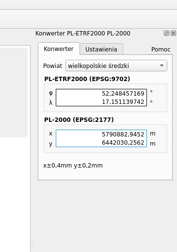
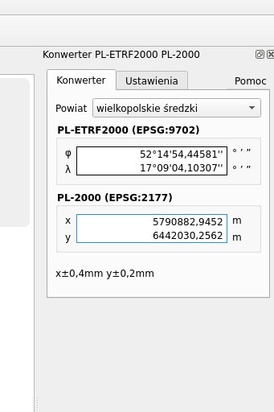

Konwerter współrzędnych punktu układu PL-ETRF2000 do współrzędnych w układzie PL-2000. Wtyczka została utworzona w QGIS 3.34.

Instaluje się jako panel dostępny w menu Widok, Panele albo po kliknięciu prawym przyciskiem na dowolnym pasku narzędzi głównego okna.

Wersja 1.1.5

  
